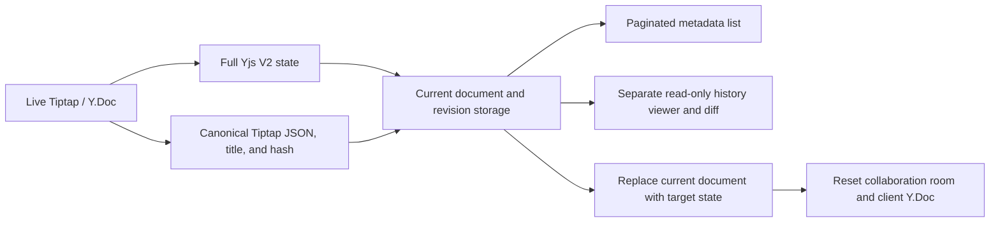

# Tiptap × Yjs V2 revision history

English · [简体中文](README.md)

This repository publishes the **V2 revision-history design and practice code** used in an editor. The backend canonicalization, write decisions, revision materialization, reads, and restore flow, together with the frontend API client, controller, structural diff, and read-only viewer, were adapted from the corresponding source modules. The public version removes product identity, private services, specialized media nodes, and environment wiring, and accepts those capabilities through interfaces.

A runnable local Tiptap + Yjs demo remains in the repository so readers can observe editing, revision creation, comparison, and restore. It uses some algorithms from the public core with file storage and a simple WebSocket transport. For production integration, use the packages and implement their host ports. See [V2 extraction scope](docs/v2-extraction.en.md) for the module mapping and adaptation boundaries.

[Outline](https://github.com/outline/outline) is a **design reference** for delayed revisions, content-and-title deduplication, a virtual current revision, metadata-only lists, and inline/block diff presentation. Persisting both full Yjs V2 state and JSON, CJK-aware diff, cursor pagination, and live collaboration restore are this project's own adaptations. The public code is sanitized and generalized from this project's V2 modules; it does not vendor Outline source code. [Outline is licensed under BSL 1.1](https://github.com/outline/outline/blob/main/LICENSE); this repository's code is released under [MIT](LICENSE).


## Repository layout

| Path | Public content |
| --- | --- |
| [`packages/v2-core/`](packages/v2-core/README.en.md) | Adapted backend V2 algorithms and service: coherent JSON/hash, collaboration persistence fields, delayed materialization, manual revisions, cursor list, detail, and restore; includes a PostgreSQL schema and storage adapter |
| [`packages/revision-history/`](packages/revision-history/README.md) | Adapted frontend V2 API, controller, Myers/structural diff, attribution index, Lit history panel, and isolated read-only ProseMirror viewer |
| `src/server/`, `src/client/` | End-to-end local demo with file storage, WebSocket, REST, and a StarterKit editor |
| `docs/` | [Architecture](docs/architecture.en.md), [data and API contract](docs/contract.en.md), [source mapping and adaptation boundary](docs/v2-extraction.en.md) |

Chinese long-form article draft: [Why revision history stores both Yjs state and JSON](docs/articles/v2-revision-history-wechat.zh-CN.md), with two exportable diagrams.

## Run locally

Node.js **22.13 or newer** is required. The project's `.npmrc` uses the Taobao npm mirror at `https://registry.npmmirror.com/`; the install command also specifies it explicitly.

```bash
npm ci --registry=https://registry.npmmirror.com/
npm run build:packages
npm run dev
```

Open <http://127.0.0.1:5173>. The API and WebSocket server listen on `127.0.0.1:3001` by default, with Vite proxying requests. Open two browser windows to observe collaboration. After editing, wait for an automatic revision or save a named manual revision, then preview, compare, and restore it in the separate history view. Demo data is stored under `.data/v2-oss/`, which is excluded from Git; any earlier local demo data stays untouched.

| Environment variable | Default | Purpose |
| --- | --- | --- |
| `PORT` | `3001` | Local API/WebSocket port |
| `DATA_DIR` | `.data/v2-oss` | Local demo data directory |
| `FRONTEND_ORIGINS` | `http://127.0.0.1:5173,http://localhost:5173` | Allowed browser origins, comma separated |

Example values are in [`.env.example`](.env.example); export the values you want to change before starting the process. The frontend development address is fixed at `127.0.0.1:5173`.

```bash
npm test
npm run check:public
npm run typecheck
npm run build
```

## V2 data and restore



The body lives in `Y.XmlFragment('default')` and the title in `Y.Text('title')`. The same Y.Doc produces full V2 state and canonical JSON: state is authoritative for restore, while JSON supports detail, preview, and diff. Automatic revisions are scheduled after the current state is persisted and deduplicated by semantic body hash plus title; manual revisions may repeat identical content. The history viewer has a separate read-only editor instance and never writes historical JSON into the live editor. After restore, connected clients must discard their old Y.Doc and reconnect. Clients with offline storage must also clear that document's cache to prevent stale CRDT content from merging back.

## Integration boundaries

`packages/v2-core` accepts a host ProseMirror schema, `DocumentStore`, `RevisionStore`, `Scheduler`, `RoomReset`, and optional attribution, event, and failure-marker ports. The repository provides a PostgreSQL storage reference adapter. The host supplies the queue, cross-instance room reset, authorization, and collaboration service. `packages/revision-history` accepts a service prefix, authentication, mount points, the host editor runtime, and optional read-only media NodeViews.

For standard Redis integration, use `createRedisDelayedJobRegistry` ([Redis 6.2+ `GETDEL`](https://redis.io/docs/latest/commands/getdel/) and standard `EVAL`) and `createBullMQRevisionQueueDriver` with `createDurableScheduler`. The interfaces also allow another durable queue and TTL registry. With Redis Cluster, the registry's per-document keys share one hash tag, while the BullMQ Queue and Worker share a separate queue hash tag. See the [backend package guide](packages/v2-core/README.en.md) for wiring.

The local `src/` demo is an independent lightweight integration. It uses the core package's canonicalization, cursor, and deduplication algorithms but does not run the full `V2HistoryService`, PostgreSQL adapter, or frontend `RevisionHistory` extension. It listens only on localhost by default and has no account system. Before integrating into a real service, add document read/write authorization, per-document transactional locks, durable jobs, cross-instance room eviction, and JSON↔Yjs round-trip validation for custom nodes.

## License

The code is released under the [MIT License](LICENSE).
