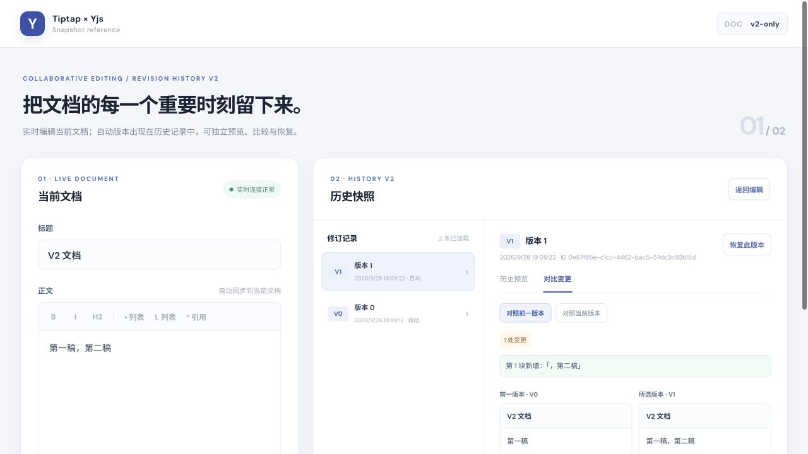
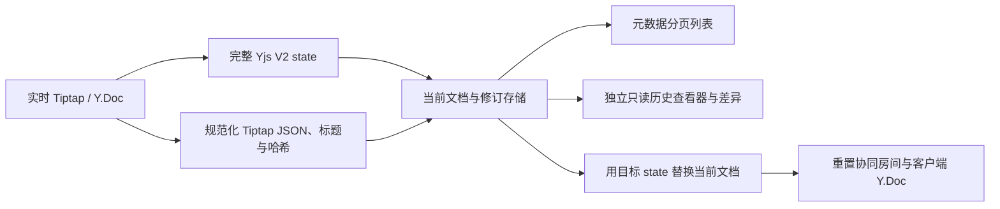

# Tiptap × Yjs V2 修订历史

[English](README.en.md) · 简体中文

这个仓库开放一套已经用于编辑器的 **V2 修订历史模式与实践代码**。后端的规范化、写入判定、修订物化、查询与恢复逻辑，以及前端的 API 客户端、历史控制器、结构化差异和只读查看器，均由相应源模块适配而来。公开版本移除了业务身份、私有服务、专用媒体节点和环境绑定，通过接口注入这些能力。

仓库同时保留一个可在本机运行的 Tiptap + Yjs 演示，方便观察编辑、建版、比较和恢复。它使用公开核心的部分算法，采用文件存储与简单 WebSocket；生产接入应使用下述包与相应端口实现。具体模块映射和改造边界见 [V2 提取范围](docs/v2-extraction.zh-CN.md)。

修订历史的延迟建版、正文加标题判重、虚拟当前版本、元数据列表及行内/块级差异，以 [Outline](https://github.com/outline/outline) 为**设计参考**。本项目的完整 Yjs V2 state + JSON、CJK 差异、游标分页和在线协同恢复是针对自身环境实现的实践。公开代码来自本项目 V2 模块的脱敏与通用化改造，未内置 Outline 源码。[Outline 使用 BSL 1.1](https://github.com/outline/outline/blob/main/LICENSE)；本仓库代码按 [MIT](LICENSE) 发布。



## 仓库结构

| 路径 | 公开内容 |
| --- | --- |
| [`packages/v2-core/`](packages/v2-core/README.md) | 适配后的后端 V2 算法与服务：同源 JSON/哈希、协同持久化字段、延迟物化、手动建版、历史 state 按需补齐 JSON、游标列表、详情、恢复；附 PostgreSQL schema 与存储适配器 |
| [`packages/revision-history/`](packages/revision-history/README.zh-CN.md) | 适配后的前端 V2 API、控制器、Myers/结构化差异、归属索引、Lit 历史面板与隔离的只读 ProseMirror 查看器 |
| `src/server/`、`src/client/` | 本机文件存储、WebSocket、REST 与 StarterKit 编辑器组成的端到端演示 |
| `docs/` | [架构流程](docs/architecture.zh-CN.md)、[数据与接口契约](docs/contract.zh-CN.md)、[来源映射与适配边界](docs/v2-extraction.zh-CN.md) |

技术公众号长文草稿：[在 Yjs 协同编辑器里做版本历史：为什么要同时保存 state 和 JSON？](docs/articles/v2-revision-history-wechat.zh-CN.md)，含数据流、恢复与历史快照升级三张可导出的机制示意图。

## 本机运行

需要 Node.js **22.13 或更新版本**。项目的 `.npmrc` 使用淘宝 npm 镜像 `https://registry.npmmirror.com/`；也可以在安装命令中显式指定。

```bash
npm ci --registry=https://registry.npmmirror.com/
npm run build:packages
npm run dev
```

打开 <http://127.0.0.1:5173>。API 与 WebSocket 默认监听 `127.0.0.1:3001`，Vite 代理请求。打开两个窗口即可观察协同编辑；编辑后等待自动修订，或手动保存命名版本，然后在独立历史视图中预览、比较、恢复。演示数据存于 `.data/v2-oss/`，不会进入 Git；原先本地演示数据保持原样。

| 环境变量 | 默认值 | 用途 |
| --- | --- | --- |
| `PORT` | `3001` | 本机 API/WebSocket 端口 |
| `DATA_DIR` | `.data/v2-oss` | 本机演示数据目录 |
| `FRONTEND_ORIGINS` | `http://127.0.0.1:5173,http://localhost:5173` | 允许的浏览器来源，逗号分隔 |

配置示例在 [`.env.example`](.env.example)；运行前将需要的值导出到环境中。前端开发地址固定为 `127.0.0.1:5173`。

```bash
npm test
npm run check:public
npm run typecheck
npm run build
```

## V2 数据与恢复方式



正文在 `Y.XmlFragment('default')`，标题在 `Y.Text('title')`。新建版本从同一个 Y.Doc 派生完整 V2 state 和规范化 JSON：state 是恢复依据，JSON 用于详情、预览与差异。自动修订在当前状态持久化后调度，以正文语义哈希和标题判重；手动修订允许相同内容重复保存。历史查看器有独立的只读编辑器实例，不向实时编辑器写入历史 JSON。恢复后，在线客户端必须丢弃旧 Y.Doc 并重连；使用离线缓存时还须清除对应缓存，避免旧 CRDT 内容重新合并。

### 历史快照按需升级

导入的历史修订可能只有**完整 V2 state**，缺少用于预览和差异的 JSON。列表只检查字段是否存在；首次请求这类修订的详情时，服务端按需读取 state，经宿主提供的有界 worker 池解码，并在 worker 内按当前 ProseMirror schema 规范化、计算哈希。状态上限为 **5 MiB**。回填使用只在 JSON 仍为空时写入的 CAS，仅更新派生的 JSON、哈希、`schemaVersion` 和可选归属；原始 state、来源标记、时间与版本保持不变。归属派生失败时正文仍可读，但跳过回填以便下次重试；未删除记录的回填写库失败不影响已成功解码的读取。

`availability` 表示能否预览，`restorable` 独立表示原始 state 是否存在。超限、解码失败或 schema 不兼容时不能预览或比较；恢复仍须单独验证原始 state。worker 满载由宿主返回可重试的 HTTP 503。此处的升级是**补齐历史 JSON 投影**，不压缩活跃 Y.Doc 的 state，也不自动迁移不同 ProseMirror schema。当前 `schemaVersion` 为 **1**；仓库没有批量升级 worker。流程和失败语义见[架构说明](docs/architecture.zh-CN.md#3-历史快照按需升级)与[数据契约](docs/contract.zh-CN.md#历史快照按需升级契约)。

## 接入边界

`packages/v2-core` 接受宿主提供的 ProseMirror schema、`DocumentStore`、`RevisionStore`、`Scheduler`、`RoomReset`，以及可选的 `RevisionProjectionDecoder`、归属、事件和失败标记端口。仓库提供 PostgreSQL 存储参考适配；有界解码 worker 池、队列、跨实例房间重置、鉴权与实际协同服务由接入方实现。`packages/revision-history` 接受服务地址、鉴权、挂载点、宿主编辑器运行时和可选的只读媒体 NodeView。

标准 Redis 接入可选用 `createRedisDelayedJobRegistry`（Redis 6.2+ 的 [`GETDEL`](https://redis.io/docs/latest/commands/getdel/) 与标准 `EVAL`）和 `createBullMQRevisionQueueDriver`，再交给 `createDurableScheduler`；接口也允许替换其他持久队列和 TTL 登记表。Redis Cluster 下登记表的同文档键共用 hash tag，BullMQ 的 Queue/Worker 另行共用一个队列 hash tag。完整接线见 [后端包说明](packages/v2-core/README.md)。

本机 `src/` 演示是独立的轻量接线实现，使用核心包的规范化、游标和判重算法；它没有运行完整的 `V2HistoryService`、PostgreSQL 适配器或前端 `RevisionHistory` 扩展。默认只监听本机，没有账号体系。接入真实服务时须先完成文档读写授权、同文档事务锁、可靠任务调度、多实例房间驱逐和自定义节点的 JSON↔Yjs 往返验证。

## 许可证

代码按 [MIT License](LICENSE) 开放。
