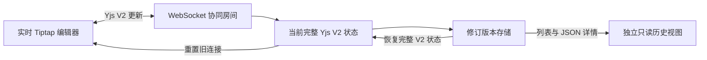

# Tiptap × Yjs V2 修订历史参考实现

一个可在本机运行的前后端示例，提取 V2 修订历史的数据与交互契约：持久化完整 Yjs V2 状态及同源 JSON、自动和手动建版、历史预览与差异、恢复后重建协同文档。代码为独立编写的参考实现，使用公开依赖，不包含业务系统源码。


## 快速开始

需要 Node.js 22.13 或更新版本。仓库的 `.npmrc` 已将依赖源设为淘宝 npm 镜像 `https://registry.npmmirror.com/`。

```bash
npm install
npm run dev
```

打开 <http://127.0.0.1:5173>。服务端监听 `127.0.0.1:3001`，Vite 将 API 和 WebSocket 请求代理过去。可以打开两个浏览器窗口观察同步。编辑后等待自动修订出现，也可以通过单独的手动创建控件保存命名版本；选择版本查看只读预览与差异，再尝试恢复。运行数据保存在本地 `.data/`，已加入 `.gitignore`。

```bash
npm test
npm run typecheck
npm run build
```

## 方案



- 正文位于 `Y.XmlFragment('default')`，标题位于 `Y.Text('title')`。两者作为一个完整 Y.Doc 编码为 V2 update；单独的 Yjs snapshot 元数据不能重建正文。
- 当前状态与修订版本一起持久化。版本详情提供 Tiptap JSON 供只读预览，完整 V2 状态用于恢复。
- 手动版本允许相同内容重复保存；自动版本在持久化后按正文语义哈希和标题去重。
- 恢复先保存恢复前版本，再替换当前状态，并关闭旧 WebSocket 连接。客户端重建 Y.Doc，防止旧 CRDT 内容重新合并。
- 历史预览使用单独的只读编辑器实例，不会调用实时编辑器的 `setContent`。

先读 [V2 提取范围与适配差异](docs/v2-extraction.zh-CN.md)；完整流程见 [前后端方案](docs/architecture.zh-CN.md)，接口与兼容边界见 [快照契约](docs/contract.zh-CN.md)。

## 目录

| 路径 | 用途 |
| --- | --- |
| `src/server/` | Yjs 状态、文件持久化、修订 API 与 WebSocket |
| `src/client/` | 实时编辑器、修订列表、只读预览与恢复交互 |
| `docs/contract.zh-CN.md` | 数据、接口、恢复和兼容性契约 |
| `docs/architecture.zh-CN.md` | 前后端写入、预览与恢复流程 |
| `docs/v2-extraction.zh-CN.md` | V2 合同与本地示例的适配边界 |

## 生产接入

本仓库刻意保持单进程、无账号的本机示例。接入实际服务时需要加上文档读写授权、数据库事务/锁、多实例房间驱逐、持久化队列与监控。若客户端使用 IndexedDB 离线缓存，恢复后必须清理旧文档缓存再连接。基础 schema 以外的节点和 mark 需要前后端共同声明并验证 JSON↔Yjs 往返。
