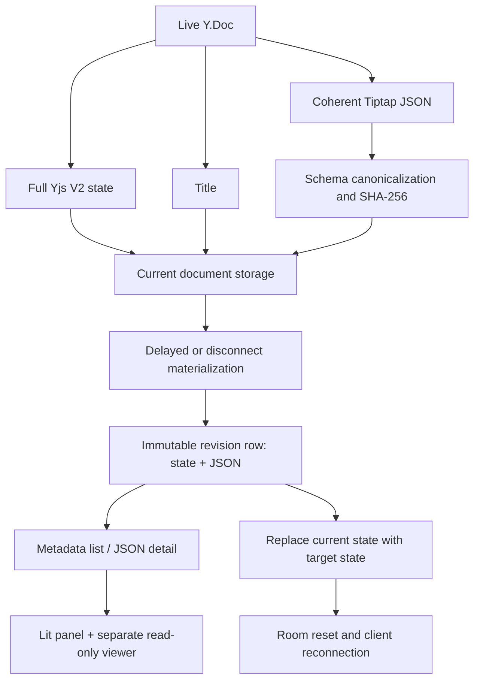

# Frontend and backend architecture of V2 revision history

English · [简体中文](architecture.zh-CN.md)

This page describes how to integrate the public practice code into a real collaborative editor and how the local demo verifies the flow. See [V2 extraction scope](v2-extraction.en.md) for source modules and adaptation boundaries, and the [contract](contract.en.md) for fields and HTTP examples.

[Outline](https://github.com/outline/outline) is a design reference for delayed revisions, body-and-title deduplication, a virtual current revision, metadata-only lists, and inline/block diff. This project's Yjs V2 state plus JSON, CJK diff, cursor pagination, and live restore have additional constraints; see [source and adaptation notes](v2-extraction.en.md).

## 1. Two coherent representations

The body lives in `Y.XmlFragment('default')` and the title in `Y.Text('title')`. From the same Y.Doc, the server obtains full `Y.encodeStateAsUpdateV2` state and Tiptap JSON. It canonicalizes JSON with the host's ProseMirror schema and computes a semantic hash. Both the current document and each revision row store V2 state. A revision's JSON supports history reading and diff; its state supports restore. Lightweight `Y.encodeSnapshotV2` metadata contains no standalone body and cannot serve as a restorable revision.



`packages/v2-core` provides `V2HistoryService`, canonicalization, a Yjs V2 decoder, and persistence ports. `schema.postgres.sql` and `PostgresDocumentStore` / `PostgresRevisionStore` are PostgreSQL reference adapters. The host supplies collaboration transport, authorization, queue instances, and room management. `packages/revision-history` provides the frontend API, controller, diff, Lit UI, and read-only viewer. The host owns the live editor and provider.

## 2. Writes and revision creation

1. After the collaboration service applies an incoming update to its active Y.Doc, it obtains full V2 state, body JSON, and title from that same state.
2. `prepareWrite` performs schema canonicalization, stable serialization, and hashing outside the document lock. `commitWrite` reads the current document under the lock and advances `revisionCount` only when the semantic body hash or title changes. It writes state, JSON, title, hash, and schema version together. If a structure cannot be canonicalized, it does not advance V2 metadata; the host may still persist raw state under its own policy and mark the failure.
3. **After the current state is durably persisted**, `Scheduler` schedules a delayed job. The last disconnect may trigger earlier materialization. A worker first compares the current content with the latest revision cheaply, then acquires the document lock, rereads the latest revision, and makes the authoritative decision. It creates an automatic revision only when the body hash or title differs.
4. Manual revisions are bookmarks. `createManual` saves the current complete state and JSON under the document lock, even when the content is identical. Revision versions increase monotonically under that lock.
5. The list uses an opaque `(version DESC, id DESC)` cursor and returns metadata and availability flags only. The client fetches JSON detail after selection. Detail also accepts the virtual `current-<documentId>` ID so the frontend can compare a revision with the current document.

Canonical content comparison avoids duplicate automatic revisions for the same visible body. A Yjs update's bytes contain client clocks and edit history and cannot serve as a business-content deduplication key. Custom nodes and marks need compatible schemas in the editor, server canonicalizer, and history viewer, plus JSON↔Yjs round-trip checks.

## 3. History view and diff

The frontend `RevisionHistory` extension uses `RevisionHistoryController` for open/close, pagination, selection, comparison, and restore confirmation. `RevisionApiClient` handles the V2 envelope, cursor, auth header, and stable error classification. `RevisionViewerHost` displays historical JSON in a separate read-only ProseMirror `EditorView`. When the history panel is open, the host should lock the live body, title, and toolbar. It must not write historical JSON into the collaborative editor.

The diff modules tokenize JSON structure and text, calculate sequence, node, formatting, and attribution changes, and produce viewer decorations. Without trustworthy per-position attribution, changes stay neutral; the person who saved a revision is not assumed to have authored every character. The host may inject read-only media NodeViews. For unsupported custom nodes, the viewer presents readable content where possible and reports degradation.

List, detail, and comparison selection may change quickly. The controller cancels obsolete requests or discards late responses so old detail cannot replace the current selection. Restore is a write: after the HTTP acknowledgement, the host must still wait for the collaboration reset signal and a fresh sync before making the live editor writable again.

## 4. Restore and connected clients

```mermaid
sequenceDiagram
  participant UI as History panel / host
  participant API as V2HistoryService
  participant Store as Document and revision stores
  participant Room as RoomReset adapter
  UI->>API: restore(document, revision)
  API->>Store: Read and validate original target V2 state
  API->>Room: flushAndReset(document, reason, persist)
  Room->>Room: Gate new room loads; flush active Y.Doc
  Room->>Store: Save pre_restore when content differs
  Room->>Store: Replace current document with original target state
  Room-->>UI: Broadcast reset; close old connections
  API->>Store: Write restore-source audit row
  API-->>UI: Return restore result
  UI->>UI: Destroy old editor, Y.Doc, and provider
  UI->>Room: Clear offline copy and reconnect
```

Restore writes the revision's **original full state** back to the current document. Decoding validates the state and derives coherent JSON/title; applying the target update to the old Y.Doc would merge CRDT histories. The host's `RoomReset` implementation must block old-room loads and writes during replacement, send reset to every instance, and close old connections. With IndexedDB or another offline Yjs copy, the client must clear that document's cache before reconnecting, or stale updates can reenter the new room.

The public service requires successful persistence of the pre-restore protection revision before replacement. It writes the restore-source audit row afterward, so a production host needs alerting and compensation for audit failure. Access control must complete before constructing `DocumentContext`; a document ID in the query string is only a routing key.

## 5. Local demo and verification

`src/server/` uses file storage, a per-document serial queue, and a simple WebSocket; `src/client/` uses React and StarterKit. The demo reuses the core package's canonicalization, cursor, and deduplication algorithms but has its own REST, WebSocket, and revision model, as well as its own frontend UI. Its `document.reset`, close code 4205, and transport `epoch` demonstrate a stale-connection fence; `epoch` belongs only to the demo transport. See the root [README](../README.en.md) for runtime settings.

Package tests cover coherent state/JSON, deduplication under a lock, list pagination, manual revisions, restore, and the frontend controller, diff, and read-only isolation. A real deployment also needs integration checks for its schema, transactional database, durable queue, cross-instance rooms, and offline clients.
