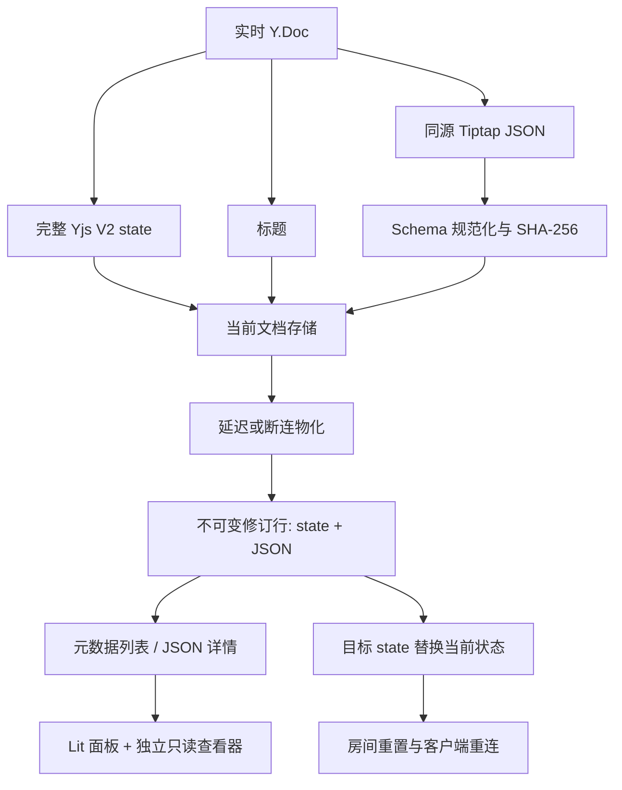
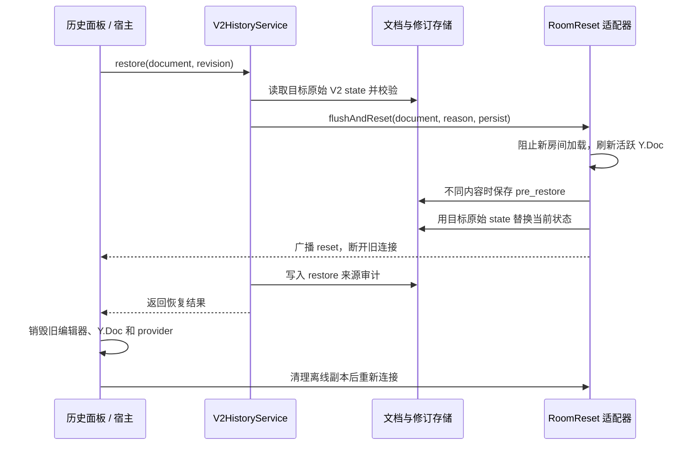

# V2 修订历史的前后端架构

[English](architecture.en.md) · 简体中文

本页描述公开的实践代码如何接入真实协同编辑服务，以及仓库中的本机演示如何验证链路。模块来源与适配边界见 [V2 提取范围](v2-extraction.zh-CN.md)，字段和 HTTP 示例见 [契约](contract.zh-CN.md)。

[Outline](https://github.com/outline/outline) 是延迟建版、正文与标题判重、虚拟当前版本、元数据列表和行内/块级差异的设计参考。本项目的 Yjs V2 state + JSON、CJK 差异、游标分页与在线恢复另有实现约束；详见 [来源说明](v2-extraction.zh-CN.md)。

## 1. 两份同源表示

编辑中的正文位于 `Y.XmlFragment('default')`，标题位于 `Y.Text('title')`。服务端从同一 Y.Doc 取得完整 `Y.encodeStateAsUpdateV2` 状态和 Tiptap JSON，再用接入方提供的 ProseMirror schema 规范化 JSON、计算语义哈希。当前文档与修订行都保存 V2 state；修订行的 JSON 用于历史阅读和差异，state 用于恢复。单独的 `Y.encodeSnapshotV2` 元数据没有正文，不能作为可恢复版本。

`packages/v2-core` 提供 `V2HistoryService`、规范化逻辑、Yjs V2 解码器和持久化端口。`schema.postgres.sql` 与 `PostgresDocumentStore` / `PostgresRevisionStore` 是 PostgreSQL 参考适配。协同传输、鉴权、队列实例和房间管理由宿主提供。`packages/revision-history` 提供前端 API、控制器、差异、Lit UI 和只读 viewer；宿主拥有实时编辑器及 provider。

## 2. 写入与建版

1. 协同服务收到更新后，在它管理的活跃 Y.Doc 中完成变更，从该状态同时取完整 V2 state、正文 JSON 和标题。
2. `prepareWrite` 在文档锁外进行 Schema 规范化、固定序列化和哈希计算。`commitWrite` 在锁内读当前文档，只在正文语义哈希或标题变化时推进 `revisionCount`，并同次写入 state、JSON、标题、哈希及 schema 版本。结构无法规范化时，不推进 V2 元数据，宿主仍可按自身策略持久化原始 state，并记录失败标记。
3. **当前状态持久化成功后**，`Scheduler` 安排延迟任务。最后一个连接离开时可提前安排物化。任务执行时先快速比较当前内容与最新修订，再拿同文档锁重新读取并作权威判重；只有正文哈希或标题变化时才写自动版本。
4. 手动版本是用户书签：`createManual` 在文档锁内保存当前完整 state 和 JSON，即使内容相同也新增一条。修订版本号在锁内单调递增。
5. 列表按 `(version DESC, id DESC)` 使用不透明游标，只返回元数据与可用性标记；选中版本后再取 JSON 详情。详情也接受 `current-<documentId>` 虚拟 ID，供前端与当前文档比较。

规范化内容比对用于避免相同可见正文产生重复自动版本。Yjs update 的二进制字节包含客户端时钟和编辑历史，不能作为业务内容判重依据。自定义节点和 mark 需由编辑器、服务端规范化器和历史查看器共享兼容的 schema，并验证 JSON↔Yjs 往返。

## 3. 查看与差异

前端 `RevisionHistory` 扩展通过 `RevisionHistoryController` 管理打开、分页、选中、比较与恢复确认；`RevisionApiClient` 处理 V2 信封、游标、鉴权头和稳定错误分类。`RevisionViewerHost` 在独立只读 ProseMirror `EditorView` 中显示历史 JSON。宿主在历史面板打开时应锁定实时正文、标题和工具栏，不把历史 JSON 写入协同中的编辑器。

差异模块先对 JSON 结构和文本分词，再计算序列差异、节点/格式变化和归属区间，最后生成 viewer decorations。缺少可靠逐处归属数据时，差异保持中性，不把修订创建人视作每处文字作者。宿主可以注入只读媒体 NodeView；未提供的自定义节点按 viewer 的降级策略展示可读内容并报告降级。

列表、详情与比较对象可能快速切换。控制器取消旧请求或丢弃晚到响应，保证旧详情不会覆盖当前选择。恢复是写操作，收到 HTTP 应答后仍需等待协同层重置信号和重新同步，才能重新开放实时编辑。

## 4. 恢复与在线客户端

恢复把目标修订的**原始完整 state**写回当前文档。解码仅用于验证和派生同源 JSON/标题；不能把目标 update 应用到旧 Y.Doc，因为这会合并 CRDT 历史。`RoomReset` 的宿主实现应在持久化替换期间阻止旧房间加载与写入，并把 reset 发送到所有实例，关闭旧连接。使用 IndexedDB 等离线 Yjs 副本时，客户端须清除对应文档缓存，避免旧更新重新进入新房间。

公开服务要求恢复前保护版本持久化成功才继续替换。恢复来源审计随后另写；生产宿主应处理其失败告警与补偿。权限检查必须在构造 `DocumentContext` 之前完成，查询参数中的文档 ID 只是路由键。

## 5. 本机演示和验收

`src/server/` 使用文件存储、单文档串行队列与简单 WebSocket，`src/client/` 使用 React + StarterKit。演示复用核心包的规范化、游标和判重算法，但有自己的 REST、WebSocket 与修订模型；前端演示也有自己的 UI。它的 `document.reset`、关闭码 4205 和传输 `epoch` 展示旧连接围栏，其中 `epoch` 只属于演示传输。运行环境配置见根目录 [README](../README.md)。

包级测试关注同源 state/JSON、锁内判重、列表分页、手动版本、恢复和前端状态机/差异/只读隔离。真实部署还需按宿主 schema、事务数据库、持久队列、跨实例房间与离线客户端分别做集成验证。
