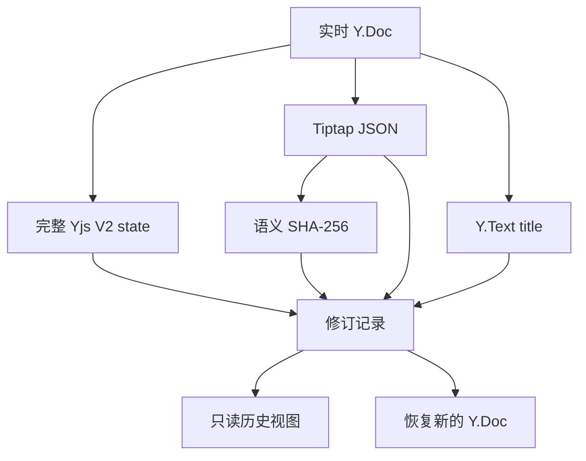
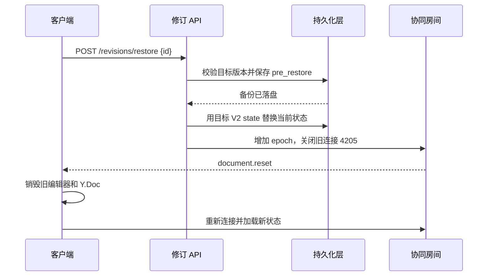

# 前后端快照方案

## 1. 两份表示各司其职

完整 Yjs V2 update 是恢复依据，Tiptap JSON 是历史阅读和比较依据。服务端从同一个 Y.Doc 派生两者，并同时记录标题与内容哈希。只存 `Y.encodeSnapshotV2` 得到的状态向量和删除集无法独立还原正文。

`default` 是唯一的正文章节名。新增自定义节点时，前端编辑 schema、服务端 JSON 转换 schema、历史 viewer schema 要保持一致；未知结构不能直接从历史 JSON 写回实时文档。

## 2. 创建修订

1. 客户端的 Tiptap Collaboration 扩展把编辑写入本地 Y.Doc，并通过 WebSocket 发送 V2 更新。
2. 服务端把更新应用到该文档的活跃 Y.Doc，持久化完整状态，并广播给其他连接。
3. 自动修订只在持久化成功后产生。正文语义哈希和标题都与最新版本相同，就不新增自动版本。
4. 手动修订是用户书签，即使内容未变也写入。版本号在单文档串行写入中分配。
5. 列表仅返回元数据；选中版本后才请求 JSON 详情，避免列表传输每个版本的大字段。

示例用本机文件和定时器说明顺序；生产系统可换成数据库事务、行锁与延迟队列。哈希判断必须基于规范化内容，不能比较 Yjs update 原始字节，因为同一可见内容可以有不同 CRDT 历史。

## 3. 预览与比较

历史详情返回标题和 Tiptap JSON。前端新建独立只读 Tiptap 实例渲染该 JSON，不能在正在协同的编辑器上调用 `setContent`。如果展示差异，两边都先转成同一 schema 的 JSON；当前版本应说明其时间基线，服务端落库的“当前”可能落后于客户端尚未发送的编辑。

列表、详情和当前版本请求是异步的：选择版本或关闭面板后，要取消旧请求，或用请求序号丢弃晚到的响应。恢复请求会改变服务端状态，不应因关闭弹窗而假定它已取消。

## 4. 恢复与在线客户端

恢复不能把旧 V2 update 直接 `apply` 到已有 Y.Doc；那会把两份 CRDT 历史合并，而不是精确回到旧内容。服务端用目标完整状态构建新的 Y.Doc，再替换当前状态。旧连接的更新携带旧 epoch，会被拒绝。

本示例要求恢复前备份成功才继续。生产环境仍需要跨实例广播/驱逐、数据库锁、重试与审计。如果使用 IndexedDB 等离线副本，客户端接到状态替换信号后还须清除该文档缓存，否则旧更新可能重新进入新房间。

## 5. 测试边界

- Yjs V2 encode/apply 与 Tiptap JSON 语义往返，包含标题、正文和基础 mark。
- 手动同内容重复建版；自动同内容去重；版本顺序和游标分页。
- 跨文档 ID、损坏请求和不存在版本返回错误，不泄露别的文档内容。
- 恢复前版本留存，在线连接重置，旧 epoch 更新拒绝；进程重启后仍能读取并恢复。
- 历史 viewer 与实时编辑器隔离，异步请求不覆盖新选择。
