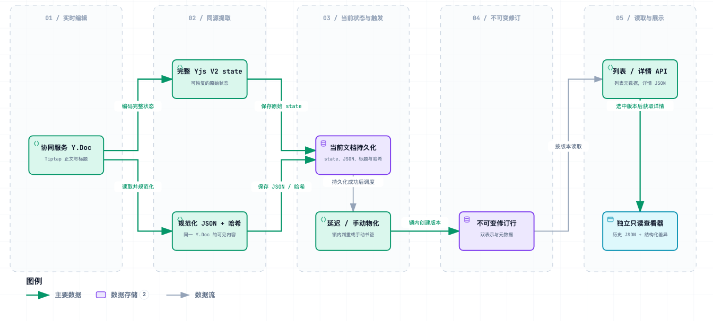
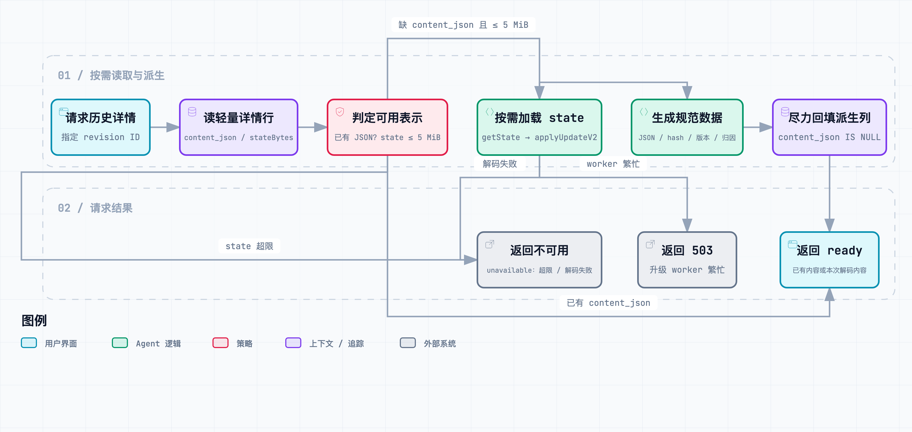
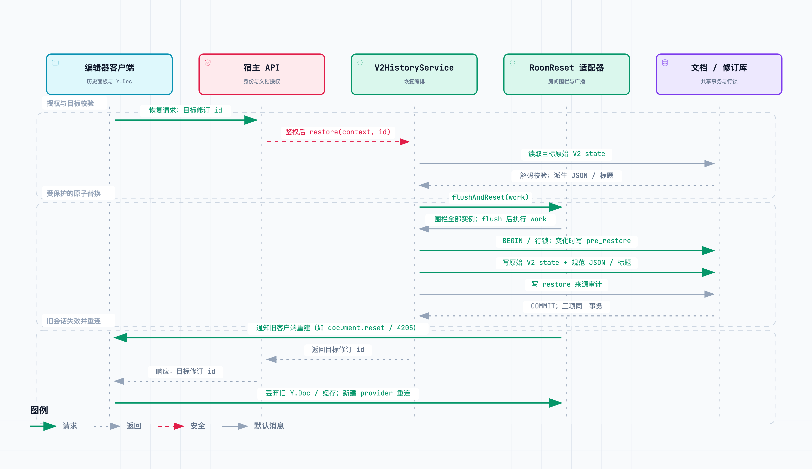

# 在 Yjs 协同编辑器里做版本历史：为什么要同时保存 state 和 JSON？

<!-- 公众号排版稿。配图使用 assets/ 下的静态 PNG；交互版 HTML 供审稿时查看。 -->

实时协同编辑解决了“几个人同时改一份文档”的问题，却没有自动回答另一些问题：**上周三的内容是什么？这一版和上一版差在哪里？编辑器升级后旧快照还能看吗？点下恢复后，在线用户会不会把旧内容又同步回来？**

我们在开源的 [Tiptap × Yjs V2 修订历史实践](https://github.com/MoMeak9/tiptap-yjs-snapshot)中，把这些问题拆成五条边界：同源保存、延迟建版、隔离查看、按需升级、受控恢复。这里的“V2”指整套修订历史的数据与交互契约，不只是 Yjs 的 V2 update 编码。



*图 1：同一个 Y.Doc 派生恢复用的 state 和阅读用的 JSON；列表与详情按需读取。建议点图放大查看。*

## 一、协同状态不能代替可读的版本

Yjs 的完整 update 保留 CRDT 历史，适合在恢复时重建文档；但它不是给人阅读、搜索和计算结构差异的格式。反过来，Tiptap JSON 适合展示和比较，却不能代替原始 Yjs state：只把旧 JSON 填进正在协同的编辑器，可能产生一段新的编辑操作，并不能保证回到目标版本的 CRDT 状态。

因此一次持久化要从**同一个 Y.Doc**取得两份表示：

- `Y.encodeStateAsUpdateV2(doc)`：完整状态，恢复的依据。这里不能用只包含状态向量与删除集的轻量 `Y.encodeSnapshotV2` 代替。
- 正文 `default` fragment 转出的 Tiptap JSON：经同一份 ProseMirror Schema 规范化后，用于详情、预览、差异和 SHA-256 内容哈希。
- `Y.Text('title')`：标题单独保存；自动建版时与正文哈希一起判重。

接入代码的关键顺序可以缩写为：

```ts
const json = TiptapTransformer.fromYdoc(doc, 'default')
const title = doc.share.has('title')
  ? doc.getText('title').toString()
  : undefined
const state = Y.encodeStateAsUpdateV2(doc)
const prepared = history.prepareWrite({
  documentId, writePath: 'collaboration_store',
  persistenceV2Enabled: true, content: json,
  ...(title === undefined ? {} : { title }),
})
await history.commitWrite(prepared, (fields, writer) =>
  writer.write(documentId, {
    state, ...(title === undefined ? {} : { title }), ...fields,
  })
)
await history.scheduleDelayed(documentId)
```

这段“双表示”是**宿主接入契约**：核心包在 `prepareWrite` 中完成 Schema round-trip、稳定字段顺序、属性排序与哈希；正常路径下，`commitWrite` 把派生字段和原始 state 交给同一写入事务。它不会自行从协同房间抓取 Y.Doc。若前后端 Schema 不一致，未知节点需要被识别或走可观察的降级路径；真正无法规范化时，保留原始 state、冻结 V2 哈希与计数并报告失败，不能悄悄算出一个“看似稳定”的错误哈希。

## 二、频繁保存当前状态，不等于频繁建版

当前文档可以频繁保存，但历史列表若每次输入都增加一版，很快会失去可读性。V2 在当前状态**成功持久化之后**安排延迟任务；最后一位在线用户离开时，可以提前提交即时建版任务。手动版本（可命名）则是书签：即使内容相同，也允许留下两条记录。

自动任务消费时做两次检查：先用当前正文哈希与标题快速判断，再进入文档事务、锁住同一文档行，重新读取最新版本后判重。后一次才是权威判断，因为多个任务可能同时通过第一次检查。写正文、分配版本号、插入修订都遵守同一文档锁；只有正文语义或标题变化才推进业务修订计数，纯元数据更新不会冒充一次内容修改。

这里的保证是**并发下不会因为两次检查的间隙插入重复版本**，并非“队列端到端恰好执行一次”。任务仍需要可靠队列、重试与监控。

### Redis 环境不再需要代理绕行

原有运行环境对部分 Redis 指令有限制。公开适配器面向标准 Redis 6.2+：用 Lua `EVAL` 按入队时间原子登记最新延迟任务，用 `GETDEL` 领取当前待取消任务；如果取消时队列暂时出错，只在“最新任务水位”仍匹配时恢复登记。较新的任务即使已被另一实例领取，旧任务也不能借重试重新占位。

登记键和水位键使用同一文档的 hash tag，以满足 Redis Cluster 的同槽规则；BullMQ 队列自身的多键操作也需要单独配置同槽前缀。登记表只决定“当前要取消哪条任务”，不会自动删除此前所有已入队任务；旧任务还要经过修改时间判定和文档锁内判重。公开版不再保留原环境针对 `EVALSHA`、`CLIENT SETNAME`、`MULTI/EXEC` 或 `INFO` 等标准命令的代理兼容分支。**解除指令限制不等于直接打开跨实例文档状态同步**：房间所有权与重置仍由协同宿主独立处理。

## 三、历史只负责看，不碰正在编辑的 Y.Doc

后端列表只返回版本号、时间、标题、作者等元数据和可用性，不把每版的正文与二进制状态一起发送。选中某一版后才请求详情；`current-<documentId>` 是可供比较的虚拟“当前版本”，不进入历史列表。

前端拿到两份 JSON 后，使用同一 Schema 计算差异：先配对块级节点，再为可能的改写寻找同类型节点，最后对行内 token 做 Myers 序列比较。中文没有天然空格边界，因此分词使用 `Intl.Segmenter`，并在 CJK 段继续细分；格式和节点属性变化独立报告。删除内容在被展示的目标版本中已不存在，无法直接高亮，于是历史查看器以只读 widget 显示它。

关键隔离是一个**独立、不可编辑的 ProseMirror `EditorView`**。它不挂实时 provider，也不把历史 JSON `setContent` 到正在协同的编辑器。打开历史时，宿主把实时正文、标题和工具栏锁为只读；关闭后按原有权限恢复。逐处作者归属是可选输入，没有证据时显示中性色，不能把“谁创建了快照”猜成“谁写了这段字”。

## 四、快照升级：补齐可读投影，与升级 Schema 是两回事

历史数据不会因为发布了一版新编辑器就自动变成新格式。这里至少有两个容易混淆的“V2”：`Y.encodeStateAsUpdateV2` 是 **Yjs 二进制更新编码**；修订行上的 `sourceFormat` 说明这条记录最初是否同时保存了**可读 JSON**。`schema_version` 则标记 Tiptap JSON 的内容结构。三者解决的问题不同。

### 已提取的实践：详情访问时按需补齐 JSON

一些存量修订保留了完整 Yjs state，却没有供预览和 diff 使用的规范化 JSON。这类记录由宿主或迁移工具导入；公开包提供读取和按需补齐能力，不提供批量导入脚本。列表只读元数据，不因为这些行而解码所有正文；当用户打开某条详情时，服务才先检查 `content_json`。若已有 JSON，直接返回；若缺 JSON 但有 state，则经可注入的有界解码端口执行：`applyUpdateV2 → fromYdoc('default') → 当前 Schema 规范化 → 稳定序列化与 SHA-256`。如果启用归属提取，它也从同一次解码的文档树计算，避免正文和作者坐标来自不同投影。

公开包已将这条路径提取为 `RevisionProjectionDecoder` 和 `RevisionStore.backfillProjectionIfMissing` 两个端口，并提供 `decodeV2Projection` 解码函数；**它不自行启动 worker 线程**。宿主需要把解码端口接到有界 worker 池，并设置容量、超时、内存上限和观测。5 MiB 只是压缩 state 的输入上限，展开后的 JSON 可能更大。这样既保留原实践的按需升级顺序，也不把业务队列或运行环境写死在包里。



*图 2：已提取的按需回填流程；worker 池由宿主注入，原始完整 state 仍是恢复依据。建议点图放大查看。*

这条路径有边界：超过 5 MiB 的 state 不在详情请求里强行转换；worker 繁忙可以返回 503；转换失败时**本次详情**返回“内容不可预览”，并不等于持久写下失败标记。**可预览/可比较与可恢复分别判断**——只要完整 state 仍可用，缺少 JSON 不必自动剥夺恢复资格。成功解码后，服务以 `WHERE content_json IS NULL` 做幂等条件回填，只补 JSON、哈希、`schema_version` 和归属；原 state、来源标识与修改时间保持不动。若归属提取失败，本次正文仍可阅读，但跳过回填，让后续请求可以重试归属；回填写入失败也不会把已解码成功的阅读变成失败。新建修订则从开始就同时保存两份表示，逐步减少需要回填的历史行。

导入存量修订时还有一个实际顺序：**先让最新一条只有 state 的修订完成详情回填，再启用自动建版**。否则最新行缺少正文哈希，自动任务无法可靠地和它做语义判重，可能额外生成一条内容相同的版本。若这条修订因大小或 Schema 不兼容而无法回填，宿主应先决定如何处理这个可观察的重复风险。

### 尚未自动完成的事：跨内容 Schema 版本迁移

公开核心导出了 `migrateToCurrentSchemaVersion(json, fromVersion, migrations)`：它要求版本合法、逐级存在纯函数迁移步骤，缺一步就拒绝。**但当前 `CURRENT_SCHEMA_VERSION` 仍为 1，默认迁移表为空；详情和恢复也没有自动调用跨版本迁移。** 这是一道显式门禁与接入点，不能写成“快照已经自动升级到任意新 Schema”。批量回填工具也尚未在公开仓库实现。

真正升级内容 Schema 时，需要先冻结新旧结构样本，注册 `vN → vN+1` 转换并验证 ProseMirror JSON 与 Yjs 往返，再决定是只读投影还是受控分批回填。历史的原始 state 应保留以便追溯；恢复前还要用目标 Schema 独立验证语义兼容。只读查看器遇到未知节点时可以保住可读文字并上报降级，但**展示降级不是无损迁移**，不能把它的结果写回实时文档。另有针对当前 Yjs state 膨胀的压缩重建路径，属于不同的治理问题；公开包尚未包含它。

## 五、恢复不是一次 `setContent`

真正危险的场景是：数据库已被替换成旧版本，在线用户的旧 Y.Doc 仍在房间里；它下一次发出的更新可能把恢复前内容再次合并进来。所以恢复需要同时处理**持久化状态**和**活跃协同会话**。



*图 3：房间隔离之后，在一个文档事务中完成保护、替换和审计；提交后再通知客户端重建。建议点图放大查看。*

公开核心通过 `RoomReset` 端口要求宿主先阻止旧房间继续写入并刷新活跃状态。随后在**同一个文档事务**里锁定当前文档，按需插入 `pre_restore` 保护版，写入目标修订的**原始完整 V2 state**及解码派生的 JSON；目标 state 含标题时同步写标题，最后插入记录来源的 `restore` 审计版。任一步写入失败，事务整体回滚。

事务成功后，宿主再广播 `document.reset` 并断开旧连接；客户端销毁旧编辑器、Y.Doc 和 provider，清除该文档的离线缓存，再连接并加载新状态。数据库事务只覆盖数据库写入，**不意味着跨实例广播也具有分布式原子性**；房间门闩、通知失败与客户端重连仍须在具体部署中验证。

在手机上阅读时，可以把恢复记成四步：**围栏并刷新在线状态 → 一个事务内保护、替换和审计 → 提交后通知旧客户端 → 丢弃旧 Y.Doc 与缓存并重连**。图中的 HTTP 入口与 `document.reset` 是宿主接线示例；核心包只定义恢复服务和房间重置端口，不强制宿主采用某个路由或消息协议。

## 六、开源的是边界与算法，不是一套硬编码环境

仓库里有两部分主代码：后端 [`v2-core`](https://github.com/MoMeak9/tiptap-yjs-snapshot/tree/main/packages/v2-core) 提供规范化、游标、按需投影回填、建版、恢复和 `DocumentStore` / `RevisionStore` / `Scheduler` / `RoomReset` 端口，并附 PostgreSQL 与标准 Redis 适配；前端 [`revision-history`](https://github.com/MoMeak9/tiptap-yjs-snapshot/tree/main/packages/revision-history) 保留 API 客户端、控制器、结构化 diff、Lit 面板与只读 viewer。私有鉴权、用户目录、业务媒体节点和环境地址都换成可注入能力或合成测试数据。

根目录的 `src/` 另有一个文件存储加 WebSocket 的本机演示，便于观察流程；它只使用核心包的部分算法，**没有运行完整的 `V2HistoryService`、PostgreSQL 适配器或前端扩展**。要接入实际产品，还必须补齐文档授权、同文档事务锁、可靠队列、跨实例房间重置、自定义 Schema 往返和离线缓存清理。

本方案以 [Outline](https://github.com/outline/outline) 的修订历史交互与部分语义作为设计参考，包括延迟建版、正文与标题判重、虚拟当前版本以及行内/块级差异呈现。这里的 Yjs V2 state + JSON 双表示、CJK 差异、游标和在线恢复按本项目需求实现；仓库**没有内置 Outline 源码**。Outline 使用 [BSL 1.1](https://github.com/outline/outline/blob/main/LICENSE)，本仓库的改造代码按 [MIT](https://github.com/MoMeak9/tiptap-yjs-snapshot/blob/main/LICENSE) 发布。

协同编辑的数据会不断流动，版本历史的工作则是把其中某些时刻固定成**可解释、可比较、可安全回到的边界**。这个边界不是一份二进制，也不是一个“恢复”按钮；它是一组从写入到重连都要守住的不变量。

---

**代码与延伸阅读**

- [Tiptap × Yjs V2 修订历史仓库](https://github.com/MoMeak9/tiptap-yjs-snapshot)
- [后端接入与 PostgreSQL/Redis 适配](https://github.com/MoMeak9/tiptap-yjs-snapshot/blob/main/packages/v2-core/README.md)
- [前端历史组件与宿主接线](https://github.com/MoMeak9/tiptap-yjs-snapshot/blob/main/packages/revision-history/README.zh-CN.md)
- [Outline：修订历史设计参考](https://github.com/outline/outline)
- [数据流交互图](assets/v2-flow.html) · [升级流程交互图](assets/v2-upgrade.html) · [恢复时序交互图](assets/v2-restore.html)
